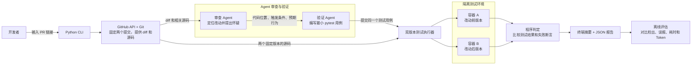

# pr-regression-agent
AI-powered PR review with reproducible tests to detect changes that break existing behavior.

## 粗架构图

下图展示双 Agent 模式。单 Agent 模式由同一个 Agent 完成审查和验证，复用 Git 工具、执行器和报告模块。

```mermaid
flowchart LR
    DEV["开发者"] -->|"输入 PR 链接"| CLI["Python CLI"]
    CLI --> SRC["GitHub API + Git<br/>固定两个提交，提供 diff 和源码"]

    subgraph AG["Agent 审查与验证"]
        REV["审查 Agent<br/>定位改动并提出怀疑"]
        VER["验证 Agent<br/>编写最小 pytest 用例"]
        REV -->|"代码位置、触发条件、预期行为"| VER
    end

    SRC -->|"diff 和相关源码"| REV
    VER -->|"提交同一个测试用例"| RUN["双版本测试执行器"]
    SRC -->|"两个固定版本的源码"| RUN

    subgraph TEST["隔离测试环境"]
        OLD["容器 A<br/>改动前版本"]
        NEW["容器 B<br/>改动后版本"]
    end

    RUN --> OLD
    RUN --> NEW
    OLD --> JUDGE["程序判定<br/>比较测试结果和失败断言"]
    NEW --> JUDGE
    JUDGE --> OUT["终端摘要 + JSON 报告"]
    OUT --> EVAL["离线评估<br/>对比检出、误报、耗时和 Token"]
```
